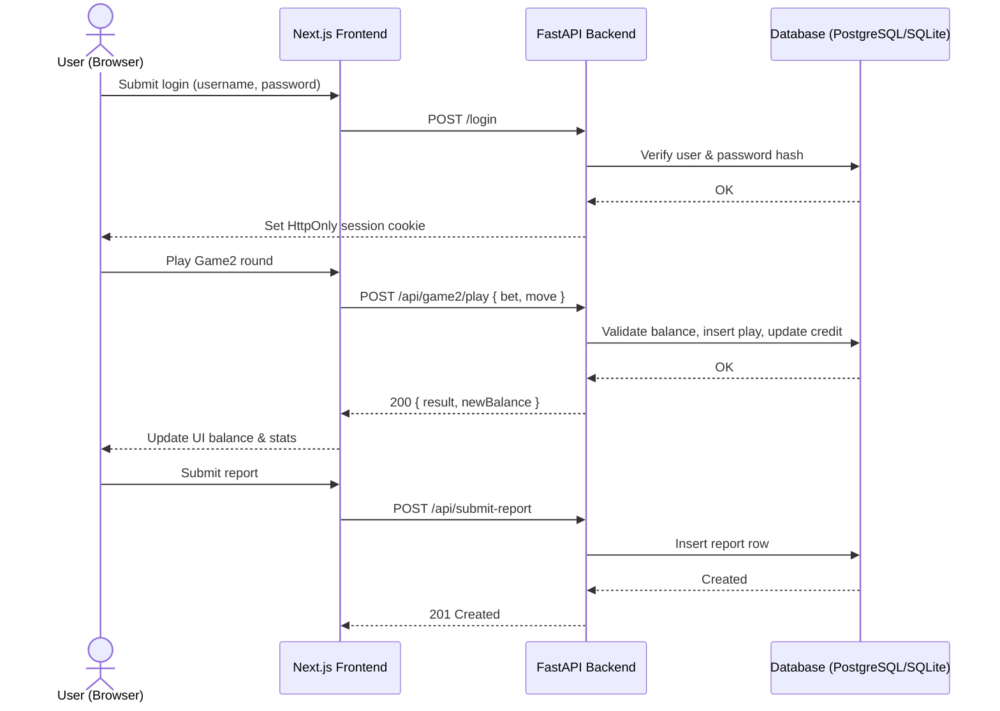

## 4.1 System Architecture

คำอธิบาย (ไทย): แผนภาพนี้แสดงองค์ประกอบหลักของระบบและการเชื่อมต่อระหว่างผู้ใช้ (เบราว์เซอร์), ส่วนหน้า Next.js, ส่วนหลัง FastAPI และฐานข้อมูล (PostgreSQL/SQLite) รวมถึงกลไกการยืนยันตัวตนด้วยคุกกี้แบบ HttpOnly และหมวด API หลักที่ใช้สื่อสารระหว่างส่วนหน้าและส่วนหลัง

English: The diagram shows how the User (browser), Next.js frontend, FastAPI backend, and the database interact. It also highlights cookie-based authentication (HttpOnly), RBAC checks, and the main REST endpoints.

### Component view

```mermaid
flowchart TB
    U[User\n(Web Browser)]
    FE[Next.js Frontend\nReact App Router\n(frontend/app/*)]
    BE[FastAPI Backend\nAuth/RBAC, Business Logic\nbackend/app/main.py]
    DB[(PostgreSQL / SQLite)\nSQLAlchemy Models\nbackend/app/models.py\nTables: users, user_credits, wheel_games, rps_matches, reports]

    U <--> |HTTPS GET/POST| FE
    FE --> |REST (JSON)\n/login, /me, /balance, /deposit, /withdraw\n/api/game1/*, /api/game2/*, /api/submit-report, /reports| BE
    BE --> |ORM Queries\n(Validate, Insert, Update)| DB
    BE -.-> |Set/Read HttpOnly Cookie\n(SameSite=Lax) on /login| U

    classDef svc fill:#eef,stroke:#446,stroke-width:1px;
    classDef data fill:#efe,stroke:#464,stroke-width:1px;
    class FE,BE svc;
    class DB data;
```

Key notes
- Frontend: Next.js pages under `frontend/app/*`, guards via `Protected.jsx` (auth) and `Adminonly.jsx` (RBAC).
- Backend: FastAPI in `backend/app/main.py` with endpoints for Auth, Balance, Game1, Game2, Reports, and Admin dashboard.
- Database: SQLAlchemy models in `backend/app/models.py`. Tables include `users`, `user_credits`, `wheel_games`, `wheel_game_stats`, `rps_matches`, `rps_match_stats`, and `reports`.
- Security: Login sets an HttpOnly cookie (SameSite=Lax). Backend checks role for admin-only routes.

### Typical request flow (sequence)



How to export as image (optional)
- In VS Code, install a Mermaid extension to preview and export. Or use any Mermaid-compatible renderer to generate PNG/SVG from this Markdown.
